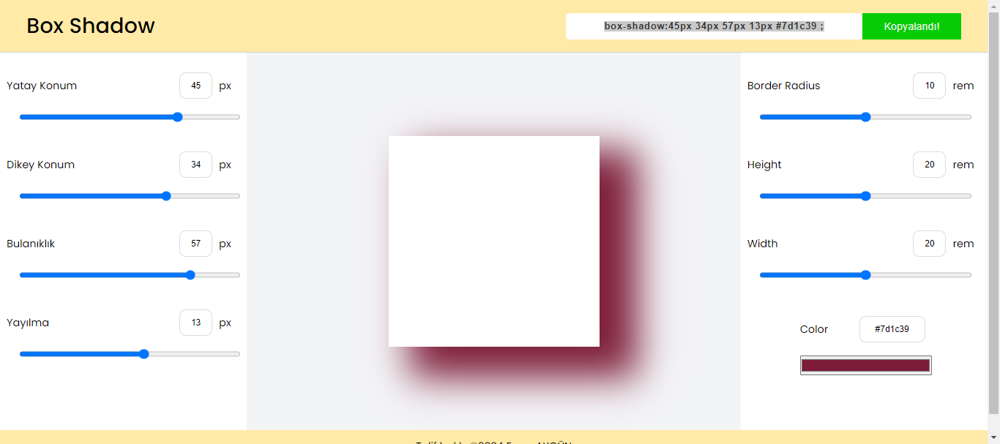

<h1>Box Shadow</h1>

Bu projem, benim gibi Css box-shadow özelliğini bir türlü istediği gibi ayarlayamayanların işini kolaylaştırmak için...
Box-Shadow uygulamamda,  kutu boyutlarını,   gölge rengini, gölgenin yatay ve dikey konumunu, bulanıklığını, yayılma oranını ayarlayıp kodu göster butonuna basmanız yeterli. Sizin için box-shadow kodunu kopyalayacak. 

Umarım benim işime yaradığı gibi sizlerinde işinize yarar. 

uProjemin demosuna:[buradan]( https://aaygunn.github.io/BoxShadow/) ulaşabilirsiniz.

(Henüz responsive değil. Mobilden giren arkadaşların, browserinizin masaüstü sitesi seçeneğiyle girmesini tavsiye ederim).

<h3>Kullanılan Teknolojiler</h3>

<ul>
  <li>HTML</li>
  <li>CSS</li>
  <li>Javascript</li>
</ul>

<h3>Ekran Görüntüsü</h3>

